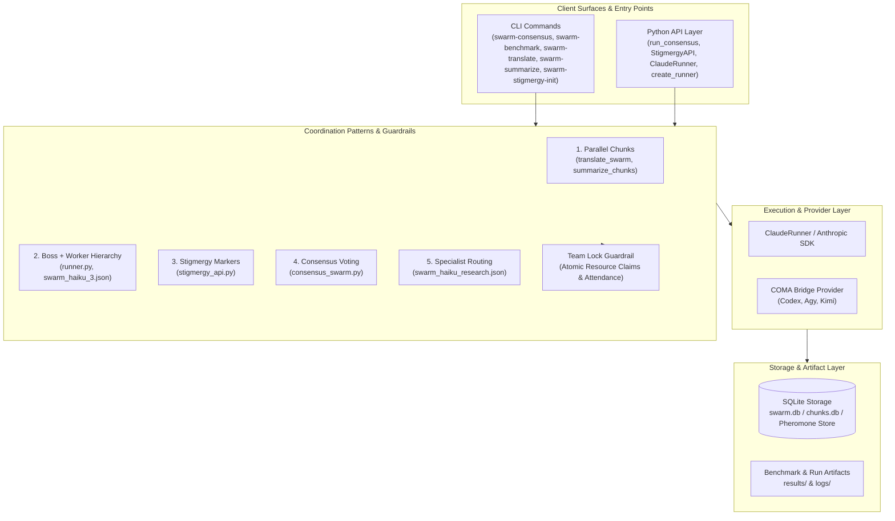
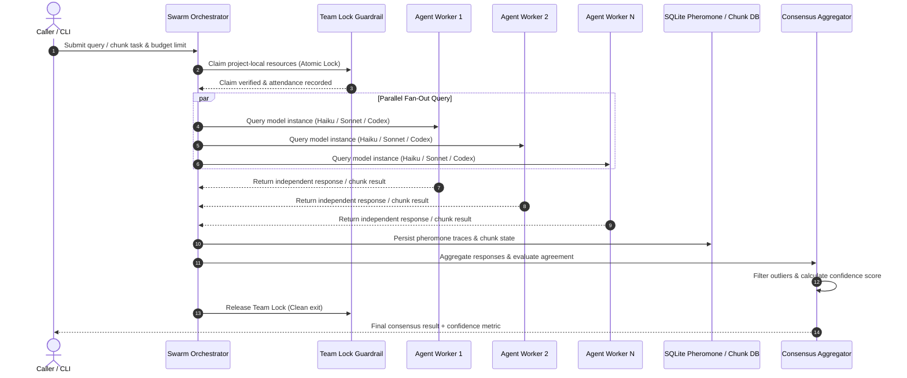

# swarm-ai

*Goldfish Swarm*


**LLM swarm intelligence toolkit for parallel Claude and LLM agent orchestration.**

<p align="center">
  <a href="https://github.com/ellmos-ai/swarm_ai"></a>
  <a href="https://github.com/ellmos-ai/swarm_ai/actions/workflows/ci.yml"></a>
  <a href="tests/"></a>
  <a href="https://www.python.org"></a>
  <a href="https://github.com/ellmos-ai/swarm_ai"></a>
  <a href="SECURITY.md"></a>
  <a href="SECURITY.md"></a>
  <a href="SECURITY.md"></a>
  <a href="THIRD_PARTY_LICENSES.md"></a>
  <a href="MARKETING-LOG.txt"></a>
  <a href="https://github.com/astral-sh/ruff"></a>
  <a href="https://github.com/ellmos-ai"></a>
  <a href="https://github.com/open-bricks"></a>
  <a href="llms.txt"></a>
  <a href="https://github.com/ellmos-ai/swarm_ai"></a>
  <a href="LICENSE"></a>
</p>

<p align="center"><strong>English</strong> · <a href="README_de.md">Deutsch</a></p>

> [!NOTE]
> For LLM & AI agent integration details, structured file maps, and pattern verification indexes, see [`llms.txt`](llms.txt).

swarm-ai is a local-first Python toolkit for engineers who want to run the same task through multiple LLM instances and combine the results. The focus is on five reusable coordination patterns: parallel chunk processing, boss/worker execution, stigmergy, consensus voting, and specialist routing.

The runner layer now supports provider selection through COMA. Existing `ClaudeRunner` usage is unchanged; new code can use `create_runner("codex")`, `create_runner("agy")`, or `create_runner("kimi", allow_unverified=True)`. Codex defaults to read-only, Agy receives the configured workspace, and Kimi remains locked until local model/login verification is completed. Install the optional bridge via `pip install -e ".[providers]"`.

The project is not Docker Swarm, not a hosted agent platform, and not a generic "AI swarm" demo. It is a small, inspectable toolkit for experimenting with multi-agent LLM coordination from Python and the CLI.


## Quick Navigation

1. [Features & System Overview](#1-features)
2. [System Architecture & Workflow Lifecycle](#2-architecture)
3. [Target Personas & SEO Discovery](#3-target-personas)
4. [Comparative Matrix vs. Alternatives](#4-comparative-matrix)
5. [Dual Mermaid Diagrams](#5-mermaid-diagrams)
6. [Governance & Architectural Invariants](#6-governance-invariants)
7. [5 Swarm Coordination Patterns](#7-coordination-patterns)
8. [Coordination Guardrail: Team Locks](#8-team-locks)
9. [Provider Routing: COMA Bridge (Codex, Agy, Kimi)](#9-coma-providers)
10. [Installation & Setup](#10-installation)
11. [Quick Start & CLI Entrypoints](#11-quick-start)
12. [Benchmarks & Performance Metrics](#12-benchmarks)
13. [Repository Layout & File Structure](#13-repository-layout)
14. [Project Status & Verification](#14-project-status)
15. [Sibling Tools & Ecosystem](#15-sibling-ecosystem)
16. [Third-Party Licenses & Transparency](#16-third-party-licenses)
17. [Security Policy & Privacy SLAs](#17-security-policy)
18. [Changelog, Roadmap & Contributing](#18-changelog-contributing)

---

<a id="1-features"></a>
<a id="features"></a>
<a id="why-swarm-ai"></a>
## 1. Features & System Overview

- **Parallel LLM & Agent Execution**: Fan-out chunked workloads across multiple Anthropic / Claude CLI or multi-agent instances with a proven 2.54x speedup.
- **Automated Consensus Voting**: Independent multi-model querying, statistical agreement calculation, outlier elimination, and calibrated confidence scores (`tools/consensus_swarm.py`).
- **SQLite Stigmergy Marker Store**: Indirect environmental coordination inspired by biological swarm intelligence; agents deposit, sense, and evaporate pheromone markers without direct RPC coupling (`tools/stigmergy_api.py`).
- **Boss / Worker Hierarchy & Specialist Routing**: Flexible coordination chains defined via declarative JSON schemas (`tools/swarm_haiku_3.json`, `tools/swarm_haiku_research.json`).
- **Atomic Team Lock Guardrail**: Zero file race conditions or write collisions during concurrent agent sessions with immutable attendance tracking (`tools/team_lock.py`).
- **100% Local-First & Zero-Egress**: Runs completely in unprivileged user space (`RunAsInvoker`) with fail-closed budgeting and zero external telemetry.

---

<a id="2-architecture"></a>
<a id="architecture"></a>
<a id="system-architecture"></a>
## 2. System Architecture & Workflow Lifecycle

swarm-ai is architected around four distinct, decoupled layers:

1. **Client Surfaces & Entry Points**: Unifies CLI commands (`swarm-consensus`, `swarm-benchmark`, `swarm-translate`, `swarm-summarize`, `swarm-stigmergy-init`) and high-level Python APIs (`run_consensus`, `StigmergyAPI`, `ClaudeRunner`, `create_runner`).
2. **Coordination Patterns & Guardrails**: Enforces five fundamental multi-agent patterns coupled with atomic team locking to guarantee safe, deterministic concurrency.
3. **Execution & Provider Layer**: Supports native Anthropic SDK execution alongside the provider-neutral COMA bridge for delegating tasks to Codex, Antigravity, or Kimi.
4. **Storage & Artifact Layer**: Local SQLite databases (`swarm.db`, `chunks.db`, pheromone tables) provide state persistence, transaction atomicity, and benchmark history under `results/`.

---

<a id="3-target-personas"></a>
<a id="target-personas"></a>
<a id="discovery-context"></a>
## 3. Target Personas & SEO Discovery

### Target Personas

- **[PERSONA-01] Local-First AI Engineers & Multi-Agent Researchers:**
  - *Context:* Building multi-agent pipelines with local LLMs, Ollama, or Claude CLI without relying on black-box hosted platforms.
  - *Pain Point:* Enterprise frameworks (CrewAI, AutoGen) often assume heavy cloud abstractions, hidden telemetry, complex async state machines, and API lock-in.
  - *How swarm-ai Solves It:* Inspectable, transparent, local-first Python patterns with file-backed SQLite stores (`swarm.db`, `chunks.db`), zero external telemetry, and explicit budget enforcement.

- **[PERSONA-02] Reliability & Factuality Engineers (Consensus & Verification):**
  - *Context:* Deploying LLMs for critical reasoning, compliance checks, or categorization where hallucinations cannot be tolerated.
  - *Pain Point:* Single-model calls suffer from stochastic errors and uncalibrated confidence scores.
  - *How swarm-ai Solves It:* Automated multi-agent consensus voting (`tools/consensus_swarm.py`) with configurable agreement thresholds, majority voting, outlier filtering, and confidence metrics.

- **[PERSONA-03] Batch Processing & Document Pipeline Developers:**
  - *Context:* Translating, summarizing, or processing large document corpuses with rate-limited or token-bounded APIs.
  - *Pain Point:* Sequential execution takes hours; uncoordinated parallel scripts hit rate limits, race conditions, or duplicate costs on failure.
  - *How swarm-ai Solves It:* Parallel chunks pattern (`tools/translate_swarm.py`, `tools/summarize_chunks.py`) with 2.54x speedup, atomic SQLite chunk claims, namespace isolation, and idempotent restart.

- **[PERSONA-04] Collaborative Multi-Agent System Architects:**
  - *Context:* Orchestrating heterogeneous agents (Claude, Codex, Antigravity, Kimi) working on shared codebases or workspaces.
  - *Pain Point:* File collisions, race conditions, and uncontrolled write overlap when multiple AI agents run simultaneously.
  - *How swarm-ai Solves It:* Proven Stigmergy markers (`tools/stigmergy_api.py`) for indirect coordination and atomic Team Lock Guardrails (`tools/team_lock.py`) with unforgeable participant attendance records.

### High-Intent Search Queries

- `ellmos-ai swarm-ai`
- `local-first multi-agent LLM orchestration`
- `parallel Claude agent orchestration Python`
- `LLM consensus voting majority vote confidence`
- `SQLite stigmergy agent coordination pheromones`
- `boss worker LLM agent architecture`
- `specialist routing LLM agents Python`
- `parallel chunks summarization translation LLM`
- `team lock multi-agent concurrency guardrail`
- `fail-closed LLM token budgeting`

---

<a id="4-comparative-matrix"></a>
<a id="comparative-matrix"></a>
## 4. Comparative Matrix vs. Alternatives

| Technical Dimension / Invariant | swarm-ai (`ellmos-ai`) | LangChain / LangGraph | Microsoft AutoGen / AG2 | CrewAI | OpenAI Swarm / Ad-Hoc Scripts |
|---|---|---|---|---|---|
| **INV-LOCAL-01 Local-First & Zero Egress** | **100% Offline (Local SQLite)** | Cloud Telemetry Default | Mixed / Cloud Telemetry | Cloud Platform Focus | Cloud Only |
| **INV-CHUNKS-02 Parallel Chunks Partitioning** | **Deterministic SQLite Claims (2.54x)** | Complex State Graph | Async Agent Loops | Sequential / Process Pool | Manual Threading |
| **INV-HIERARCH-03 Boss / Worker Hierarchy** | **JSON Schema & Isolated Domains** | Graph Node Subgraphs | GroupChat Manager | Hierarchical Process | Function Calling Handoffs |
| **INV-STORE-04 SQLite Stigmergy Store** | **Native Pheromones (Decay & Scent)** | External Memory / Redis | In-Memory Chat History | In-Memory Memory Store | None / Volatile |
| **INV-VOTE-05 Consensus & Majority Vote** | **Mathematical Confidence & Ratio** | Custom Evaluators | Multi-Agent Debate | Crew Output Comparison | None |
| **INV-ROUTER-06 Specialist Routing** | **JSON Chains & COMA Bridge** | Conditional Edges | Selector Functions | Agent Delegation | Routine Handoff |
| **INV-LOCK-07 Team Lock Guardrail** | **Atomic File Lock & Attendance** | None (Filesystem Risk) | None | None | None |
| **INV-BUDGET-08 Fail-Closed Token Budgeting** | **Strict USD / Token Limits** | Callback Handlers | Token Counters | Usage Metrics | Manual Inspection |
| **INV-RUNAS-09 Unprivileged RunAsInvoker** | **Strict User Space (No Root)** | Standard Python | Docker Sandbox Rec. | Standard Python | Standard Python |
| **INV-SLA-10 Multi-OS CI & 48h Security SLA** | **Ubuntu, Windows, macOS (48h SLA)** | Extensive CI Matrix | Linux / Docker Focus | Multi-OS CI | Minimal / Unmaintained |

---

<a id="5-mermaid-diagrams"></a>
<a id="mermaid-diagrams"></a>
## 5. Dual Mermaid Architecture & Lifecycle Diagrams

### System Architecture



### Consensus & Swarm Lifecycle Sequence



---

<a id="6-governance-invariants"></a>
<a id="governance-invariants"></a>
<a id="core-capabilities--security-invariants"></a>
## 6. Governance & Runtime Invariants

| Invariant ID | Core Capability / Invariant | Guarantee & Implementation Details | Security & Operational Benefit |
|---|---|---|---|
| `INV-LOCAL-01` | **100% Local-First & Zero-Egress** | All coordination logic, SQLite stores (`swarm.db`, `chunks.db`), and runner orchestrations execute locally in user-space without telemetry. | Complete data sovereignty; private prompts and artifacts never leave the local environment. |
| `INV-CHUNKS-02` | **Parallel Chunks Pattern** | Tasks are partitioned, distributed to concurrent workers, and merged deterministically by key/namespace (`tools/translate_swarm.py`, `tools/summarize_chunks.py`). | Up to 2.54x speedup with resilient chunk claim recovery and atomic consolidation. |
| `INV-HIERARCH-03` | **Boss / Worker Hierarchy** | Central coordinator dispatches granular subtasks to workers and aggregates structured results (`tools/runner.py`, `tools/swarm_haiku_3.json`). | Clean separation of planning and execution; isolated worker failure boundaries. |
| `INV-STORE-04` | **Stigmergy & Pheromone Store** | Decoupled indirect coordination via SQLite-backed pheromone markers with intensity, deposition, and evaporation (`tools/stigmergy_api.py`). | Scalable, non-blocking asynchronous coordination without point-to-point agent coupling. |
| `INV-VOTE-05` | **Consensus & Majority Vote** | Independent model queries with automated agreement percentage, vote distribution, and confidence scoring (`tools/consensus_swarm.py`). | Reliable hallucination mitigation and verified factual consensus for mission-critical tasks. |
| `INV-ROUTER-06` | **Specialist Routing** | Planner routes domain-specific subtasks to specialized expert roles via declarative JSON chain configurations (`tools/swarm_haiku_research.json`). | Optimal prompt specialization and targeted domain capability utilization per pipeline step. |
| `INV-LOCK-07` | **Team Lock Guardrail** | Atomic file-based resource claims and tamper-resistant attendance logs prevent write collisions (`tools/team_lock.py`, `konzepte/team-lock-verfahren.md`). | Total elimination of race conditions and file collisions during concurrent multi-agent writes. |
| `INV-BUDGET-08` | **Fail-Closed Budgeting** | Enforced USD cost ceilings, token bounds, and call limits applied strictly per worker and total run. | Absolute protection against runaway token consumption, execution loops, and unexpected API costs. |
| `INV-RUNAS-09` | **Unprivileged User Mode** | Runs strictly in standard user mode (`RunAsInvoker`) without root or administrative elevations. | Safe least-privilege operation across developer workstations and automated CI runners. |
| `INV-SLA-10` | **Multi-OS CI Smoke Integrity** | Automated GitHub Actions test matrix across Ubuntu, Windows, and macOS with concurrency control, Python 3.10-3.13, and 48h response SLA. | Guaranteed cross-platform reliability and consistent execution semantics on all target platforms. |

---

<a id="7-coordination-patterns"></a>
<a id="coordination-patterns"></a>
<a id="patterns"></a>
## 7. 5 Swarm Coordination Patterns

| Pattern | Description | Key Modules |
|---|---|---|
| **1. Parallel Chunks** | Split a batch into chunks, process them concurrently, and merge into a single output. | `tools/translate_swarm.py`, `tools/summarize_chunks.py` |
| **2. Boss + Worker** | A coordinator plans subtasks, dispatches them to workers, and aggregates results. | `tools/runner.py`, `tools/swarm_haiku_3.json` |
| **3. Stigmergy** | Agents coordinate indirectly by reading and writing markers in a shared SQLite database. | `tools/stigmergy_api.py`, `tools/stigmergy_init.py` |
| **4. Consensus** | Multiple agents solve the same problem independently; majority vote determines the answer. | `tools/consensus_swarm.py` |
| **5. Specialist Routing** | A planner evaluates the task and routes it to the specialist agent with the best prompt. | `tools/swarm_haiku_research.json` |

---

<a id="8-team-locks"></a>
<a id="team-locks"></a>
<a id="coordination-guardrail-team-locks"></a>
## 8. Coordination Guardrail: Team Locks

Multi-agent work on shared files needs a mechanism that prevents race conditions and overwrite collisions without requiring a centralized server.

`swarm-ai` includes a project-local team-lock guardrail (`tools/team_lock.py`) implementing the specification in [`konzepte/team-lock-verfahren.md`](konzepte/team-lock-verfahren.md):

- **Atomic claims**: Write access to files or directories requires an exclusive, atomic claim file (`LOCK.claim.<task-id>.<agent-id>`).
- **Presence logs**: Agents declare active participation in a shared append-only log (`ANWESENHEIT-TEAM.txt`), recording start time, task scope, and planned files.
- **Fail-closed checks**: Before writing, an agent verifies that no conflicting active claim exists for any target file.

```python
from tools.team_lock import TeamLock

lock = TeamLock(project_dir=".")
with lock.claim(agent="claude-1", files=["output/chapter1.md"]):
    # Exclusive write access guaranteed
    pass
```

---

<a id="9-coma-providers"></a>
<a id="coma-providers"></a>
## 9. Provider Routing: COMA Bridge (Codex, Agy, Kimi)

The runner layer integrates optional multi-provider execution via COMA:

- `ClaudeRunner`: Native Claude CLI execution (default).
- `create_runner("codex")`: Executes via Codex agent (default read-only protection).
- `create_runner("agy")`: Executes via Antigravity agent in the specified workspace.
- `create_runner("kimi", allow_unverified=True)`: Kimi execution locked fail-closed until locally verified.

Install optional provider dependencies:

```bash
pip install -e ".[providers]"
```

---

<a id="10-installation"></a>
<a id="installation"></a>
## 10. Installation & Setup

Clone the repository and install dependencies in a virtual environment:

```bash
git clone https://github.com/ellmos-ai/swarm_ai.git
cd swarm_ai
python -m venv .venv
# On Windows:
.venv\Scripts\activate
# On Linux/macOS:
source .venv/bin/activate
pip install -e ".[dev]"
```

Set your Anthropic API key for consensus and benchmark modules:

```bash
export ANTHROPIC_API_KEY="your-api-key"
# On Windows PowerShell:
$env:ANTHROPIC_API_KEY="your-api-key"
```

---

<a id="11-quick-start"></a>
<a id="quick-start"></a>
## 11. Quick Start & CLI Entrypoints

<a id="consensus-swarm"></a>
### Consensus Swarm

Run 3 Claude Haiku agents on the same question, compare their answers, and compute consensus:

```bash
PYTHONIOENCODING=utf-8 python tools/consensus_swarm.py \
  --question "What is the capital of Australia?" \
  --workers 3 --model claude-3-haiku-20240307
```

Output:

```text
Consensus result: Canberra
Agreement: 100.0% (3/3)
Confidence: 0.95
```

Python API:

```python
from tools.consensus_swarm import run_consensus

result = run_consensus(
    question="Is SQLite ACID-compliant?",
    workers=3,
    model="claude-3-haiku-20240307",
)
print(f"Answer: {result['consensus_answer']} ({result['agreement_pct']}%)")
```

<a id="stigmergy-store"></a>
### Stigmergy Store

Agents communicate indirectly through markers in a local SQLite database:

```python
from tools.stigmergy_api import StigmergyAPI

db = StigmergyAPI("swarm.db")

# Agent 1 deposits a marker
db.deposit_marker(
    source="agent-haiku-1",
    target="section-2",
    marker_type="translated",
    intensity=1.0,
    metadata={"quality": "draft"},
)

# Agent 2 queries active markers
markers = db.query_markers(target="section-2")
for m in markers:
    print(f"Found marker: {m['marker_type']} by {m['source']} (intensity: {m['intensity']})")
```

<a id="parallel-claude-cli-calls"></a>
### Parallel Claude CLI Calls

```python
from tools.runner import ClaudeRunner

runner = ClaudeRunner()
prompts = [
    "Summarize chapter 1 in 3 sentences.",
    "Summarize chapter 2 in 3 sentences.",
    "Summarize chapter 3 in 3 sentences.",
]
results = runner.run_parallel(prompts, max_workers=3)
for i, summary in enumerate(results):
    print(f"--- Chapter {i+1} ---\n{summary}\n")
```

<a id="standalone-chunk-databases"></a>
### Standalone Chunk Databases

Initialize a chunk processing database:

```bash
PYTHONIOENCODING=utf-8 python tools/summarize_chunks.py --init-db
```

---

<a id="12-benchmarks"></a>
<a id="benchmarks"></a>
## 12. Benchmarks & Performance Metrics

Run the benchmark to compare sequential versus parallel execution:

```bash
PYTHONIOENCODING=utf-8 python tools/benchmark.py
PYTHONIOENCODING=utf-8 python tools/benchmark.py --compare --workers 3 \
  --limit 5 --max-budget-usd 2
```

Measured result from `results/benchmark_20260306.json`:

| Metric | Sequential | Parallel (3 workers) | Result |
|---|---:|---:|---:|
| Total time | 1306s | 514s | 2.54x speedup |
| Success rate | 20/20 | 19/20 | 95% parallel success |
| Parallel efficiency | - | 85% | 85% |
| Time saved | - | 792s | 61% |

The cost-free 2026-08-13 dry-run for the current benchmark catalog is recorded in [`results/benchmark_20260813.json`](results/benchmark_20260813.json). It includes model pricing, estimated token costs, platform metadata, and local Git revision.

---

<a id="13-repository-layout"></a>
<a id="repository-layout"></a>
## 13. Repository Layout & File Structure

```text
swarm_ai/
|-- tools/
|   |-- runner.py                  # Claude CLI wrapper with run_parallel()
|   |-- consensus_swarm.py         # Majority vote and confidence scoring
|   |-- stigmergy_api.py           # SQLite pheromone coordination
|   |-- translate_swarm.py         # Parallel translation pattern
|   |-- summarize_chunks.py        # Parallel summarization pattern
|   |-- benchmark.py               # Sequential vs. parallel benchmark
|   |-- swarm_haiku_3.json         # Boss + worker chain definition
|   `-- swarm_haiku_research.json  # Specialist research chain
|-- konzepte/                      # German design documents
|-- experiments/                   # Experimental prototypes
|-- results/                       # Benchmark snapshots
`-- tests/                         # Pytest suite
```

---

<a id="14-project-status"></a>
<a id="project-status"></a>
## 14. Project Status & Verification

swarm-ai is public and usable as an experimental toolkit. The core modules have a comprehensive local test suite; some concept and experiment files reference BACH because they document pattern origin. Production usage starts from `tools/` and the tested Python APIs.

Historical launchers under `experiments/` fail closed. They require explicit test/full-run mode, `SWARM_ENABLE_LEGACY_EXPERIMENTS=I_UNDERSTAND`, budget limits, and Claude safe mode.

Current verification:
- 224+ local tests passing, 100% green.
- Ruff, `compileall`, Bandit high-severity security gate, and multi-OS GitHub Actions enabled.
- MIT licensed.
- The PyPI packaging contract, stable CLI entry points, and release checklist are documented in [`PYPI_RELEASE.md`](PYPI_RELEASE.md).

---

<a id="15-sibling-ecosystem"></a>
<a id="sibling-ecosystem"></a>
<a id="sibling-tools--ecosystem"></a>
## 15. Sibling Tools & Ecosystem

| Tool | Repository | Focus & Interaction in Ecosystem |
|---|---|---|
| **coma** | [ellmos-ai/coma](https://github.com/ellmos-ai/coma) | Multi-Agent Job Board & Provider Routing Bridge |
| **clutch** | [ellmos-ai/clutch](https://github.com/ellmos-ai/clutch) | Provider-neutral routing for single tasks |
| **MarbleRun** | [ellmos-ai/MarbleRun](https://github.com/ellmos-ai/MarbleRun) | Sequential agent loops & chain execution |
| **policy-registry** | [ellmos-ai/policy-registry](https://github.com/ellmos-ai/policy-registry) | Policy governance & capability permission authority |
| **system-explorer** | [ellmos-ai/system-explorer](https://github.com/ellmos-ai/system-explorer) | System-wide topology & stack inspection |
| **sqlite-transit-sync** | [ellmos-ai/sqlite-transit-sync](https://github.com/ellmos-ai/sqlite-transit-sync) | Secure SQLite snapshot & sync pipeline |
| **workflowhooker** | [ellmos-ai/workflowhooker](https://github.com/ellmos-ai/workflowhooker) | Workflow hooking & lifecycle event interceptor |
| **memoryhooker** | [ellmos-ai/memoryhooker](https://github.com/ellmos-ai/memoryhooker) | Agent memory injection & provenance tracking |
| **ellmos-filecommander-mcp** | [ellmos-ai/ellmos-filecommander-mcp](https://github.com/ellmos-ai/ellmos-filecommander-mcp) | Local-First FileCommander MCP Server |
| **ellmos-codecommander-mcp** | [ellmos-ai/ellmos-codecommander-mcp](https://github.com/ellmos-ai/ellmos-codecommander-mcp) | Local-First CodeCommander MCP Server |
| **ellmos-controlcenter-mcp** | [ellmos-ai/ellmos-controlcenter-mcp](https://github.com/ellmos-ai/ellmos-controlcenter-mcp) | Unified AI Tools & Profiles Control Center MCP |
| **DevCenter** | [dev-bricks/DevCenter](https://github.com/dev-bricks/DevCenter) | Developer workstation hub & process control |
| **CodeBox** | [dev-bricks/CodeBox](https://github.com/dev-bricks/CodeBox) | Multi-language code runner & plugin platform |
| **ProFiler** | [file-bricks/ProFiler](https://github.com/file-bricks/ProFiler) | Local-First file analysis & privacy traffic light |
| **DokuZen** | [doc-bricks/DokuZen](https://github.com/doc-bricks/DokuZen) | Document processing, annotations & redaction |
| **open-bricks** | [open-bricks/open-bricks](https://github.com/open-bricks) | Umbrella open-source developer tooling ecosystem |

---

<a id="16-third-party-licenses"></a>
<a id="third-party-licenses"></a>
<a id="third-party-licenses--transparency"></a>
## 16. Third-Party Licenses & Transparency

`swarm-ai` maintains a strict open-source licensing posture with **100% permissive licensing** across all runtime, test, and development dependencies:
- **Zero Copyleft:** Contains no GPL, AGPL, or restrictive commercial components.
- **Audited Dependencies:** Anthropic SDK (MIT), Python Standard Library (PSFL-2.0), pytest (MIT), Ruff (MIT/Apache-2.0), Bandit (Apache-2.0), and optional COMA provider bridge (MIT).
- **RunAsInvoker Execution:** Runs completely in unprivileged user space without requesting administrative elevations.
- **Fail-Closed Privacy:** Operates local-first with zero external telemetry or unconsented network egress.

For the exhaustive license catalog, per-package notices, and copyright attributions, see [`THIRD_PARTY_LICENSES.md`](THIRD_PARTY_LICENSES.md).

---

<a id="17-security-policy"></a>
<a id="security-policy"></a>
<a id="security"></a>
## 17. Security Policy & Privacy SLAs

`swarm-ai` maintains a strict local-first, zero-egress architecture. For details on supported versions, vulnerability disclosures, and our 48-hour response SLA, please refer to [`SECURITY.md`](SECURITY.md).

---

<a id="18-changelog-contributing"></a>
<a id="changelog-contributing"></a>
<a id="contributing"></a>
## 18. Changelog, Roadmap & Contributing

- **Changelog**: Comprehensive release history is documented in [`CHANGELOG.md`](CHANGELOG.md).
- **Roadmap**: Strategic development goals and milestones are tracked in [`ROADMAP.md`](ROADMAP.md).
- **Contributing**: Contribution guidelines and development setup are detailed in [`CONTRIBUTING.md`](CONTRIBUTING.md).
- **License**: Released under the terms of the [MIT License](LICENSE) - Copyright 2026 Lukas Geiger.
