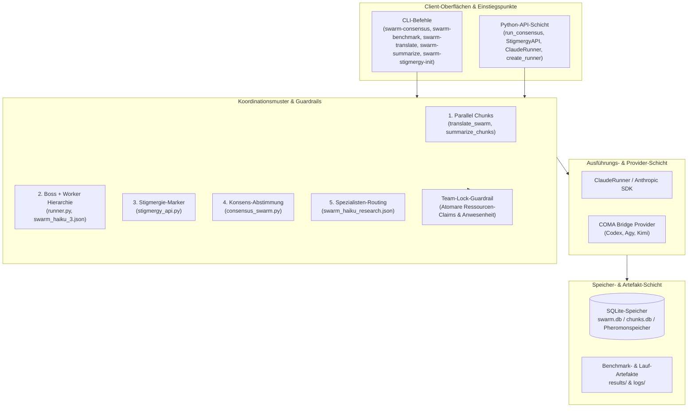
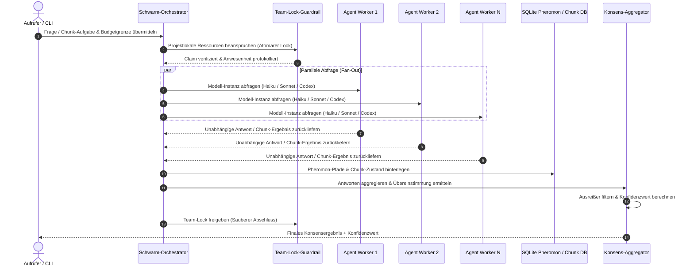

# swarm-ai

*Goldfish-Schwarm*


**LLM-Schwarmintelligenz-Toolkit für parallele Claude- und LLM-Agenten-Orchestrierung.**

<p align="center">
  <a href="https://github.com/ellmos-ai/swarm_ai"></a>
  <a href="https://github.com/ellmos-ai/swarm_ai/actions/workflows/ci.yml"></a>
  <a href="tests/"></a>
  <a href="https://www.python.org"></a>
  <a href="https://github.com/ellmos-ai/swarm_ai"></a>
  <a href="SECURITY.md"></a>
  <a href="SECURITY.md"></a>
  <a href="SECURITY.md"></a>
  <a href="THIRD_PARTY_LICENSES.md"></a>
  <a href="MARKETING-LOG.txt"></a>
  <a href="https://github.com/astral-sh/ruff"></a>
  <a href="https://github.com/ellmos-ai"></a>
  <a href="https://github.com/open-bricks"></a>
  <a href="llms.txt"></a>
  <a href="https://github.com/ellmos-ai/swarm_ai"></a>
  <a href="LICENSE"></a>
</p>

<p align="center"><a href="README.md">English</a> · <strong>Deutsch</strong></p>

> [!NOTE]
> Für LLM- & KI-Agenten-Integrationsdetails, strukturierte Dateikarten und Muster-Verifizierungs-Indizes siehe [`llms.txt`](llms.txt).

swarm-ai ist ein local-first Python-Toolkit für Entwicklerinnen und Entwickler, die dieselbe Aufgabe über mehrere LLM-Instanzen ausführen und die Ergebnisse anschließend zusammenführen wollen. Der Fokus liegt auf fünf wiederverwendbaren Koordinationsmustern: parallele Chunk-Verarbeitung, Boss-/Worker-Ausführung, Stigmergie, Konsensabstimmung und Spezialisten-Routing.

Die Runner-Schicht unterstützt jetzt die Provider-Auswahl über COMA. Bestehende `ClaudeRunner`-Verwendungen bleiben kompatibel; neuer Code kann `create_runner("codex")`, `create_runner("agy")` oder `create_runner("kimi", allow_unverified=True)` nutzen. Codex ist standardmäßig schreibgeschützt, Agy erhält den konfigurierten Workspace, und Kimi bleibt bis zur lokalen Modell-/Login-Freigabe gesperrt. Installiere die optionale Bridge mit `pip install -e ".[providers]"`.

Das Projekt ist kein Docker-Swarm-Werkzeug, keine gehostete Agentenplattform und keine generische "AI swarm"-Demo. Es ist ein kleines, prüfbares Toolkit für Experimente mit Multi-Agent-LLM-Orchestrierung über CLI und Python.


## Schnellnavigation

1. [Merkmale & Systemüberblick](#1-merkmale)
2. [Systemarchitektur & Workflow-Lebenszyklus](#2-architektur)
3. [Zielgruppen & SEO-Auffindbarkeit](#3-zielgruppen)
4. [Vergleichsmatrix gegenüber Alternativen](#4-vergleichsmatrix)
5. [Duale Mermaid-Diagramme](#5-mermaid-diagramme)
6. [Governance & Laufzeit-Invarianten](#6-governance-invarianten)
7. [5 Schwarm-Koordinationsmuster](#7-koordinationsmuster)
8. [Koordinations-Guardrail: Team-Locks](#8-team-locks)
9. [Provider-Routing: COMA-Bridge (Codex, Agy, Kimi)](#9-coma-provider)
10. [Installation & Setup](#10-installation)
11. [Schnellstart & CLI-Einstiegspunkte](#11-schnellstart)
12. [Benchmarks & Leistungsmetriken](#12-benchmarks)
13. [Repository-Struktur & Verzeichnis-Layout](#13-repository-struktur)
14. [Projektstatus & Verifikation](#14-projektstatus)
15. [Geschwister-Tools & Ökosystem](#15-geschwister-tools)
16. [Drittanbieter-Lizenzen & Transparenz](#16-drittanbieter-lizenzen)
17. [Sicherheitsrichtlinie & Datenschutz-SLAs](#17-sicherheit)
18. [Änderungsprotokoll, Roadmap & Mitwirken](#18-aenderungsprotokoll-mitwirken)

---

<a id="1-merkmale"></a>
<a id="merkmale"></a>
<a id="warum-swarm-ai"></a>
## 1. Merkmale & Systemüberblick

- **Parallele LLM- & Agenten-Ausführung**: Nebenläufige Lastverteilung von Chunk-Aufgaben über mehrere Anthropic- / Claude-CLI-Instanzen mit 2,54-facher Beschleunigung.
- **Automatisierte Konsensabstimmung**: Unabhängige Multi-Modell-Abfragen, statistische Übereinstimmungsberechnung, Ausreißerfilterung und kalibrierte Konfidenzwerte (`tools/consensus_swarm.py`).
- **SQLite-Stigmergie-Pheromonspeicher**: Indirekte Umgebungskoordination inspiriert von biologischer Schwarmintelligenz; Agenten setzen, lesen und evaporieren Pheromon-Marker ohne direkte RPC-Kopplung (`tools/stigmergy_api.py`).
- **Boss-/Worker-Hierarchie & Spezialisten-Routing**: Flexible Koordinationsketten definiert über deklarative JSON-Schemata (`tools/swarm_haiku_3.json`, `tools/swarm_haiku_research.json`).
- **Atomare Team-Lock-Guardrails**: Ausschluss von Schreibkonflikten und Race-Conditions bei parallelen Agenten-Sessions mit unveränderlichen Anwesenheitsprotokollen (`tools/team_lock.py`).
- **100% Local-First & Zero-Egress**: Läuft vollständig im unprivilegierten Benutzermodus (`RunAsInvoker`) mit Fail-Closed-Budgetierung und null externer Telemetrie.

---

<a id="2-architektur"></a>
<a id="architektur"></a>
<a id="systemarchitektur"></a>
## 2. Systemarchitektur & Workflow-Lebenszyklus

swarm-ai basiert auf vier klar getrennten, entkoppelten Architekturschichten:

1. **Client-Oberflächen & Einstiegspunkte**: Einheitliche CLI-Befehle (`swarm-consensus`, `swarm-benchmark`, `swarm-translate`, `swarm-summarize`, `swarm-stigmergy-init`) und High-Level-Python-APIs (`run_consensus`, `StigmergyAPI`, `ClaudeRunner`, `create_runner`).
2. **Koordinationsmuster & Guardrails**: Fünf universelle Multi-Agenten-Muster kombiniert mit atomaren Team-Locks für deterministische Nebenläufigkeit.
3. **Ausführungs- & Provider-Schicht**: Native Anthropic SDK-Ausführung neben der providerneutralen COMA-Bridge zur Delegation an Codex, Antigravity oder Kimi.
4. **Speicher- & Artefakt-Schicht**: Lokale SQLite-Datenbanken (`swarm.db`, `chunks.db`, Pheromontabellen) für Zustandspersistenz, Transaktionssicherheit und Benchmark-Historie unter `results/`.

---

<a id="3-zielgruppen"></a>
<a id="zielgruppen"></a>
<a id="auffindbarkeitskontext"></a>
## 3. Zielgruppen & SEO-Auffindbarkeit

### Zielgruppen & Personas

- **[PERSONA-01] Local-First KI-Ingenieure & Multi-Agenten-Forscher:**
  - *Kontext:* Entwicklung von Multi-Agenten-Pipelines mit lokalen LLMs, Ollama oder Claude CLI ohne Abhängigkeit von intransparenten Cloud-Plattformen.
  - *Problem:* Enterprise-Frameworks (CrewAI, AutoGen) erfordern oft schwere Cloud-Abstraktionen, versteckte Telemetrie, komplexe asynchrone Zustandsautomaten und Plattform-Lock-in.
  - *Lösung durch swarm-ai:* Prüfbare, transparente Local-First-Python-Muster mit dateibasierten SQLite-Speichern (`swarm.db`, `chunks.db`), null externer Telemetrie und striktem Budget-Schutz.

- **[PERSONA-02] Zuverlässigkeits- & Faktizitäts-Ingenieure (Konsens & Verifikation):**
  - *Kontext:* Einsatz von LLMs für kritische Schlussfolgerungen, Compliance-Checks oder Klassifikationen, bei denen Halluzinationen unzulässig sind.
  - *Problem:* Einzelmodell-Aufrufe leiden unter stochastischen Fehlern und unkalibrierten Konfidenzwerten.
  - *Lösung durch swarm-ai:* Automatisierte Multi-Agenten-Konsensabstimmung (`tools/consensus_swarm.py`) mit konfigurierbaren Schwellenwerten, Mehrheitsentscheid, Ausreißerfilterung und Konfidenzmetriken.

- **[PERSONA-03] Batch-Verarbeitungs- & Dokumenten-Pipeline-Entwickler:**
  - *Kontext:* Übersetzung, Zusammenfassung oder Aufbereitung großer Dokumentenbestände mit raten- oder tokenlimitierten APIs.
  - *Problem:* Sequenzielle Abarbeitung dauert Stunden; unkoordinierte parallele Skripte führen zu Rate-Limits, Race-Conditions oder doppelten API-Kosten bei Fehlern.
  - *Lösung durch swarm-ai:* Paralleles Chunks-Muster (`tools/translate_swarm.py`, `tools/summarize_chunks.py`) mit 2,54x Beschleunigung, atomaren SQLite-Chunk-Claims, Namespace-Isolation und idempotentem Neustart.

- **[PERSONA-04] Architekten kollaborativer Multi-Agenten-Systeme:**
  - *Kontext:* Orchestrierung heterogener Agenten (Claude, Codex, Antigravity, Kimi), die auf gemeinsamen Codebases oder Workspaces operieren.
  - *Problem:* Dateikollisionen, Race-Conditions und unkontrollierte Schreibkonflikte bei gleichzeitigem Agentenzugriff.
  - *Lösung durch swarm-ai:* Bewährte Stigmergie-Marker (`tools/stigmergy_api.py`) zur indirekten Koordination und atomare Team-Lock-Guardrails (`tools/team_lock.py`) mit fälschungssicheren Anwesenheitsprotokollen.

### Relevante Suchphrasen

- `ellmos-ai swarm-ai`
- `local-first multi-agent LLM orchestration`
- `parallel Claude agent orchestration Python`
- `LLM consensus voting majority vote confidence`
- `SQLite stigmergy agent coordination pheromones`
- `boss worker LLM agent architecture`
- `specialist routing LLM agents Python`
- `parallel chunks summarization translation LLM`
- `team lock multi-agent concurrency guardrail`
- `fail-closed LLM token budgeting`

---

<a id="4-vergleichsmatrix"></a>
<a id="vergleichsmatrix"></a>
## 4. Vergleichsmatrix gegenüber Alternativen

| Technische Dimension / Invariante | swarm-ai (`ellmos-ai`) | LangChain / LangGraph | Microsoft AutoGen / AG2 | CrewAI | OpenAI Swarm / Ad-Hoc Skripte |
|---|---|---|---|---|---|
| **INV-LOCAL-01 Local-First & Zero-Egress** | **100% Offline (Lokales SQLite)** | Standardmäßige Cloud-Telemetrie | Gemischt / Cloud-Telemetrie | Cloud-Plattform-Fokus | Nur Cloud |
| **INV-CHUNKS-02 Parallele Chunk-Verteilung** | **Deterministische SQLite-Claims (2,54x)** | Komplexer Zustandsgraph | Asynchrone Agentenschleifen | Sequenziell / ProcessPool | Manuelles Threading |
| **INV-HIERARCH-03 Boss-/Worker-Hierarchie** | **JSON-Schema & Isolierte Domänen** | Graphknoten-Teilgraphen | GroupChatManager | Hierarchischer Prozess | Function-Calling Handoffs |
| **INV-STORE-04 SQLite-Stigmergie-Speicher** | **Native Pheromone (Abklingen/Verdampfen)** | Externer Speicher / Redis | In-Memory Chat-Historie | In-Memory Zustandsspeicher | Keine / Flüchtig |
| **INV-VOTE-05 Konsens & Mehrheitsentscheid** | **Mathematische Konfidenz & Quote** | Benutzerdefinierte Evaluatoren | Multi-Agenten-Debatte | Crew-Output-Vergleich | Keine |
| **INV-ROUTER-06 Spezialisten-Routing** | **JSON-Chains & COMA-Bridge** | Bedingte Kanten | Selektor-Funktionen | Agenten-Delegation | Routine-Handoff |
| **INV-LOCK-07 Team-Lock-Guardrail** | **Atomare Dateisperre & Anwesenheit** | Keine (Dateisystem-Risiko) | Keine | Keine | Keine |
| **INV-BUDGET-08 Fail-Closed Token-Budgetierung** | **Strikte USD- / Token-Grenzen** | Callback-Handler | Token-Zähler | Nutzungsmetriken | Manuelle Prüfung |
| **INV-RUNAS-09 Unprivilegierter RunAsInvoker** | **Strikter Benutzermodus (Kein Root)** | Standard-Python | Docker-Sandbox empfohlen | Standard-Python | Standard-Python |
| **INV-SLA-10 Multi-OS CI & 48h Sicherheits-SLA** | **Ubuntu, Windows, macOS (48h SLA)** | Umfangreiche CI-Matrix | Linux / Docker-Fokus | Multi-OS CI | Minimal / Ungepflegt |

---

<a id="5-mermaid-diagramme"></a>
<a id="mermaid-diagramme"></a>
## 5. Duale Mermaid-Architektur & Lebenszyklus-Diagramme

### Systemarchitektur



### Konsens- & Schwarm-Lebenszyklus-Sequenz



---

<a id="6-governance-invarianten"></a>
<a id="governance-invarianten"></a>
<a id="kernfähigkeiten--sicherheitsinvarianten"></a>
## 6. Governance & Laufzeit-Invarianten

| Invarianten-ID | Kernfähigkeit / Invariante | Garantie & Implementierungsdetails | Sicherheits- & Betriebsvorteil |
|---|---|---|---|
| `INV-LOCAL-01` | **100% Local-First & Zero-Egress** | Sämtliche Koordinationslogik, SQLite-Pheromonspeicher (`swarm.db`, `chunks.db`) und Runner-Orchestrierungen laufen lokal im User-Space ohne Telemetrie. | Vollständige Datenhoheit; private Prompts und Artefakte verlassen niemals die lokale Umgebung. |
| `INV-CHUNKS-02` | **Parallel-Chunks-Muster** | Aufgaben werden partitioniert, nebenläufig an Worker verteilt und deterministisch nach Schlüssel/Namespace gemergt (`tools/translate_swarm.py`, `tools/summarize_chunks.py`). | Bis zu 2,54-fache Beschleunigung mit robuster Chunk-Wiederherstellung und atomarer Zusammenführung. |
| `INV-HIERARCH-03` | **Boss-/Worker-Hierarchie** | Zentraler Koordinator verteilt granulare Teilaufgaben an Worker und aggregiert strukturierte Ergebnisse (`tools/runner.py`, `tools/swarm_haiku_3.json`). | Klare Trennung von Planung und Ausführung; isolierte Fehlergrenzen pro Worker. |
| `INV-STORE-04` | **Stigmergie & Pheromonspeicher** | Entkoppelte indirekte Koordination über SQLite-Pheromonmarker mit Stärke, Ablage und Verdampfung (`tools/stigmergy_api.py`). | Skalierbare, blockierungsfreie asynchrone Koordination ohne direkte Punkt-zu-Punkt-Agentenkommunikation. |
| `INV-VOTE-05` | **Konsens & Mehrheitsentscheid** | Unabhängige Modellabfragen mit automatisierter Zustimmungsrate, Stimmenverteilung und Konfidenzberechnung (`tools/consensus_swarm.py`). | Zuverlässige Reduktion von Halluzinationen und gesicherter faktischer Konsens für kritische Entscheidungen. |
| `INV-ROUTER-06` | **Spezialisten-Routing** | Planer leitet domänenspezifische Teilaufgaben über JSON-Chain-Definitionen an spezialisierte Expertenrollen (`tools/swarm_haiku_research.json`). | Optimale Prompt-Spezialisierung und zielgerichteter Einsatz von Fachexpertise pro Teilschritt. |
| `INV-LOCK-07` | **Team-Lock-Guardrail** | Atomare dateibasierte Ressourcen-Claims und unveränderliche Anwesenheitsprotokolle verhindern Schreibkonflikte (`tools/team_lock.py`, `konzepte/team-lock-verfahren.md`). | Ausschluss von Race-Conditions und Dateikollisionen bei parallelen Agenten-Schreibzugriffen. |
| `INV-BUDGET-08` | **Fail-Closed Budget-Schutz** | Verbindliche USD-/Token-Kostengrenzen, Timeouts und Aufruflimits werden pro Worker und Gesamtlauf strikt durchgesetzt. | Schutz vor unkontrolliertem Token-Verbrauch, Endlosschleifen und unerwarteten API-Kosten. |
| `INV-RUNAS-09` | **Unprivilegierter User-Mode** | Läuft vollständig im Standard-Benutzermodus (`RunAsInvoker`) ohne Root-/Admin-Rechte oder Betriebssystem-Elevationen. | Sicherer Least-Privilege-Betrieb auf Entwickler-Workstations und CI-Systemen. |
| `INV-SLA-10` | **Multi-OS CI-Smoke-Integrität** | Automatisierte GitHub Actions Testmatrix auf Ubuntu, Windows und macOS mit Concurrency-Steuerung, Python 3.10-3.13 und 48h SLA. | Zuverlässiges plattformübergreifendes Verhalten und konsistente Ausführung auf allen Zielsystemen. |

---

<a id="7-koordinationsmuster"></a>
<a id="koordinationsmuster"></a>
<a id="muster"></a>
## 7. 5 Schwarm-Koordinationsmuster

| Muster | Beschreibung | Wichtigste Module |
|---|---|---|
| **1. Parallel Chunks** | Batch in Chunks teilen, parallel verarbeiten, zu einer Gesamtausgabe zusammenführen. | `tools/translate_swarm.py`, `tools/summarize_chunks.py` |
| **2. Boss + Worker** | Ein Koordinator plant Teilaufgaben, delegiert an Worker und führt Ergebnisse zusammen. | `tools/runner.py`, `tools/swarm_haiku_3.json` |
| **3. Stigmergie** | Indirekte Koordination über Marker in einer gemeinsamen SQLite-Datenbank. | `tools/stigmergy_api.py`, `tools/stigmergy_init.py` |
| **4. Konsens** | Mehrere Agenten lösen dieselbe Aufgabe unabhängig; Mehrheitsentscheid ermittelt das Ergebnis. | `tools/consensus_swarm.py` |
| **5. Spezialisten-Routing** | Ein Planer analysiert die Aufgabe und leitet sie an den passenden Spezialisten weiter. | `tools/swarm_haiku_research.json` |

---

<a id="8-team-locks"></a>
<a id="koordinations-guardrail-team-locks"></a>
## 8. Koordinations-Guardrail: Team-Locks

Wenn mehrere Agenten auf denselben Dateien arbeiten, braucht es einen Mechanismus, der Schreibkonflikte verhindert, ohne einen zentralen Server vorauszusetzen.

`swarm-ai` enthält ein projektlokales Team-Lock-Verfahren (`tools/team_lock.py`), das die Spezifikation in [`konzepte/team-lock-verfahren.md`](konzepte/team-lock-verfahren.md) umsetzt:

- **Atomare Claims**: Schreibzugriff auf Dateien oder Verzeichnisse erfordert eine exklusive Claim-Datei (`LOCK.claim.<task-id>.<agent-id>`).
- **Anwesenheitsprotokoll**: Agenten tragen sich vor Arbeitsbeginn in ein append-only Protokoll ein (`ANWESENHEIT-TEAM.txt`) mit Startzeit, Aufgabenbereich und geplanten Dateien.
- **Fail-Closed-Prüfung**: Vor jedem Schreibzugriff prüft der Agent, ob aktive Claims anderer Agenten für die Zieldateien existieren.

```python
from tools.team_lock import TeamLock

lock = TeamLock(project_dir=".")
with lock.claim(agent="claude-1", files=["output/kapitel1.md"]):
    # Exklusiver Schreibzugriff garantiert
    pass
```

---

<a id="9-coma-provider"></a>
<a id="coma-provider"></a>
## 9. Provider-Routing: COMA-Bridge (Codex, Agy, Kimi)

Die Runner-Schicht unterstützt Multi-Provider-Ausführung über COMA:

- `ClaudeRunner`: Native Claude CLI-Ausführung (Standard).
- `create_runner("codex")`: Ausführung über Codex-Agent (standardmäßig schreibgeschützt).
- `create_runner("agy")`: Ausführung über Antigravity-Agent im konfigurierten Workspace.
- `create_runner("kimi", allow_unverified=True)`: Kimi-Ausführung, bleibt fail-closed bis zur lokalen Verifikation.

Optionale Provider-Abhängigkeiten installieren:

```bash
pip install -e ".[providers]"
```

---

<a id="10-installation"></a>
<a id="installation"></a>
## 10. Installation & Setup

Repository klonen und Abhängigkeiten in einer virtuellen Umgebung installieren:

```bash
git clone https://github.com/ellmos-ai/swarm_ai.git
cd swarm_ai
python -m venv .venv
# Unter Windows:
.venv\Scripts\activate
# Unter Linux/macOS:
source .venv/bin/activate
pip install -e ".[dev]"
```

Anthropic API-Key setzen für Konsens- und Benchmark-Module:

```bash
export ANTHROPIC_API_KEY="dein-api-key"
# Unter Windows PowerShell:
$env:ANTHROPIC_API_KEY="dein-api-key"
```

---

<a id="11-schnellstart"></a>
<a id="schnellstart"></a>
## 11. Schnellstart & CLI-Einstiegspunkte

<a id="konsens-schwarm"></a>
### Konsens-Schwarm

3 Claude-Haiku-Instanzen dieselbe Frage beantworten lassen und Konsens berechnen:

```bash
PYTHONIOENCODING=utf-8 python tools/consensus_swarm.py \
  --question "Was ist die Hauptstadt von Australien?" \
  --workers 3 --model claude-3-haiku-20240307
```

Ausgabe:

```text
Consensus result: Canberra
Agreement: 100.0% (3/3)
Confidence: 0.95
```

Python-API:

```python
from tools.consensus_swarm import run_consensus

result = run_consensus(
    question="Ist SQLite ACID-konform?",
    workers=3,
    model="claude-3-haiku-20240307",
)
print(f"Antwort: {result['consensus_answer']} ({result['agreement_pct']}%)")
```

<a id="stigmergie-speicher"></a>
### Stigmergie-Speicher

Agenten kommunizieren indirekt über Marker in einer lokalen SQLite-Datenbank:

```python
from tools.stigmergy_api import StigmergyAPI

db = StigmergyAPI("swarm.db")

# Agent 1 hinterlässt einen Marker
db.deposit_marker(
    source="agent-haiku-1",
    target="abschnitt-2",
    marker_type="uebersetzt",
    intensity=1.0,
    metadata={"qualitaet": "entwurf"},
)

# Agent 2 fragt aktive Marker ab
markers = db.query_markers(target="abschnitt-2")
for m in markers:
    print(f"Marker gefunden: {m['marker_type']} von {m['source']} (Intensität: {m['intensity']})")
```

<a id="parallele-claude-cli-aufrufe"></a>
### Parallele Claude CLI-Aufrufe

```python
from tools.runner import ClaudeRunner

runner = ClaudeRunner()
prompts = [
    "Fasse Kapitel 1 in 3 Sätzen zusammen.",
    "Fasse Kapitel 2 in 3 Sätzen zusammen.",
    "Fasse Kapitel 3 in 3 Sätzen zusammen.",
]
results = runner.run_parallel(prompts, max_workers=3)
for i, summary in enumerate(results):
    print(f"--- Kapitel {i+1} ---\n{summary}\n")
```

<a id="eigenständige-chunk-datenbanken"></a>
### Eigenständige Chunk-Datenbanken

Datenbank für Chunk-Verarbeitung initialisieren:

```bash
PYTHONIOENCODING=utf-8 python tools/summarize_chunks.py --init-db
```

---

<a id="12-benchmarks"></a>
<a id="benchmarks"></a>
## 12. Benchmarks & Leistungsmetriken

Benchmark ausführen (sequenziell vs. parallel):

```bash
PYTHONIOENCODING=utf-8 python tools/benchmark.py
PYTHONIOENCODING=utf-8 python tools/benchmark.py --compare --workers 3 \
  --limit 5 --max-budget-usd 2
```

Messergebnis aus `results/benchmark_20260306.json`:

| Metrik | Sequenziell | Parallel (3 Worker) | Ergebnis |
|---|---:|---:|---:|
| Gesamtdauer | 1306s | 514s | 2,54x Speedup |
| Erfolgsquote | 20/20 | 19/20 | 95% paralleler Erfolg |
| Parallele Effizienz | - | 85% | 85% |
| Zeitersparnis | - | 792s | 61% |

Der kostenfreie Dry-Run vom 13.08.2026 ist in [`results/benchmark_20260813.json`](results/benchmark_20260813.json) dokumentiert. Er enthält Modellpreise, geschätzte Token-Kosten, Plattform-Metadaten und den Git-Commit.

---

<a id="13-repository-struktur"></a>
<a id="repository-struktur"></a>
<a id="repository-layout"></a>
## 13. Repository-Struktur & Verzeichnis-Layout

```text
swarm_ai/
|-- tools/
|   |-- runner.py                  # Claude CLI Wrapper mit run_parallel()
|   |-- consensus_swarm.py         # Mehrheitsentscheid und Konfidenz-Scoring
|   |-- stigmergy_api.py           # SQLite-Pheromon-Koordination
|   |-- translate_swarm.py         # Paralleles Übersetzungsmuster
|   |-- summarize_chunks.py        # Paralleles Zusammenfassungsmuster
|   |-- benchmark.py               # Sequenziell vs. Parallel Benchmark
|   |-- swarm_haiku_3.json         # Boss + Worker Kettendefinition
|   `-- swarm_haiku_research.json  # Spezialisten-Recherche-Kette
|-- konzepte/                      # Deutsche Design-Dokumente
|-- experiments/                   # Experimentelle Prototypen
|-- results/                       # Benchmark-Snapshots
`-- tests/                         # Pytest Testsuite
```

---

<a id="14-projektstatus"></a>
<a id="projektstatus"></a>
## 14. Projektstatus & Verifikation

swarm-ai ist öffentlich und als experimentelles Toolkit nutzbar. Die Kernmodule verfügen über eine lokale Testsuite; einige Konzept- und Experimentdateien verweisen noch auf BACH, da sie den Ursprung der Muster dokumentieren. Der produktive Einsatz erfolgt über die `tools/`-Module und die getesteten Python-APIs.

Historische Starter unter `experiments/` sind fail-closed abgesichert. Sie erfordern explizite Modi, Budgetgrenzen und den Claude-Safe-Mode.

Aktuelle Verifikation:
- 224+ lokale Tests bestanden, 100% grün.
- Ruff, `compileall`, Bandit High-Severity Gate und Multi-OS GitHub Actions aktiv.
- MIT-lizenziert.
- Das PyPI-Packaging-Schema, stabile CLI-Einstiegspunkte und die Release-Checkliste sind in [`PYPI_RELEASE.md`](PYPI_RELEASE.md) dokumentiert.

---

<a id="15-geschwister-tools"></a>
<a id="geschwister-tools"></a>
<a id="geschwister-tools--ökosystem"></a>
## 15. Geschwister-Tools & Ökosystem

| Tool | Repository | Fokus & Interaktion im Ökosystem |
|---|---|---|
| **coma** | [ellmos-ai/coma](https://github.com/ellmos-ai/coma) | Multi-Agent Job Board & Provider Routing Bridge |
| **clutch** | [ellmos-ai/clutch](https://github.com/ellmos-ai/clutch) | Provider-neutrales Routing für Einzelaufgaben |
| **MarbleRun** | [ellmos-ai/MarbleRun](https://github.com/ellmos-ai/MarbleRun) | Sequenzielle Agentenschleifen & Kettenausführung |
| **policy-registry** | [ellmos-ai/policy-registry](https://github.com/ellmos-ai/policy-registry) | Policy-Governance & Berechtigungs-Autorität |
| **system-explorer** | [ellmos-ai/system-explorer](https://github.com/ellmos-ai/system-explorer) | Systemweite Topologie- & Stack-Inspektion |
| **sqlite-transit-sync** | [ellmos-ai/sqlite-transit-sync](https://github.com/ellmos-ai/sqlite-transit-sync) | Sichere SQLite-Snapshot- & Sync-Pipeline |
| **workflowhooker** | [ellmos-ai/workflowhooker](https://github.com/ellmos-ai/workflowhooker) | Workflow-Hooking & Lifecycle-Event-Interceptor |
| **memoryhooker** | [ellmos-ai/memoryhooker](https://github.com/ellmos-ai/memoryhooker) | Agenten-Memory-Injektion & Provenienz-Tracking |
| **ellmos-filecommander-mcp** | [ellmos-ai/ellmos-filecommander-mcp](https://github.com/ellmos-ai/ellmos-filecommander-mcp) | Local-First FileCommander MCP Server |
| **ellmos-codecommander-mcp** | [ellmos-ai/ellmos-codecommander-mcp](https://github.com/ellmos-ai/ellmos-codecommander-mcp) | Local-First CodeCommander MCP Server |
| **ellmos-controlcenter-mcp** | [ellmos-ai/ellmos-controlcenter-mcp](https://github.com/ellmos-ai/ellmos-controlcenter-mcp) | Unified AI Tools & Profiles Control Center MCP |
| **DevCenter** | [dev-bricks/DevCenter](https://github.com/dev-bricks/DevCenter) | Entwickler-Workstation-Hub & Prozess-Steuerung |
| **CodeBox** | [dev-bricks/CodeBox](https://github.com/dev-bricks/CodeBox) | Multi-Sprachen-Code-Runner & Plugin-Plattform |
| **ProFiler** | [file-bricks/ProFiler](https://github.com/file-bricks/ProFiler) | Local-First Dateianalyse & Datenschutz-Ampel |
| **DokuZen** | [doc-bricks/DokuZen](https://github.com/doc-bricks/DokuZen) | Dokumentenverarbeitung, Annotation & Redaktion |
| **open-bricks** | [open-bricks/open-bricks](https://github.com/open-bricks) | Dachorganisation für Open-Source Entwicklertools |

---

<a id="16-drittanbieter-lizenzen"></a>
<a id="drittanbieter-lizenzen"></a>
<a id="drittanbieter-lizenzen--transparenz"></a>
## 16. Drittanbieter-Lizenzen & Transparenz

`swarm-ai` verfolgt eine strikte Open-Source-Lizenzpolitik mit **100% permissiver Lizenzierung** über alle Laufzeit-, Test- und Entwicklungskomponenten:
- **Kein Copyleft:** Enthält weder GPL noch AGPL noch proprietäre Bindungen.
- **Geprüfte Abhängigkeiten:** Anthropic SDK (MIT), Python Standard Library (PSFL-2.0), pytest (MIT), Ruff (MIT/Apache-2.0), Bandit (Apache-2.0) und optionale COMA-Bridge (MIT).
- **RunAsInvoker-Ausführung:** Läuft vollständig im unprivilegierten Standard-Benutzerkontext ohne Root-/Admin-Rechte.
- **Fail-Closed Datenschutz:** Arbeitet local-first ohne externe Telemetrie oder unerlaubten Netzwerkabfluss.

Das vollständige Lizenzverzeichnis mit Urheberrechtsvermerken ist in [`THIRD_PARTY_LICENSES.md`](THIRD_PARTY_LICENSES.md) einsehbar.

---

<a id="17-sicherheit"></a>
<a id="sicherheit"></a>
## 17. Sicherheitsrichtlinie & Datenschutz-SLAs

`swarm-ai` wahrt eine strikte Local-First- und Zero-Egress-Architektur. Details zu unterstützten Versionen, Schwachstellenmeldungen und unserem 48-Stunden-Reaktions-SLA finden sich in [`SECURITY.md`](SECURITY.md).

---

<a id="18-aenderungsprotokoll-mitwirken"></a>
<a id="aenderungsprotokoll-mitwirken"></a>
<a id="mitwirken"></a>
## 18. Änderungsprotokoll, Roadmap & Mitwirken

- **Änderungsprotokoll**: Vollständige Versionshistorie ist in [`CHANGELOG.md`](CHANGELOG.md) gepflegt.
- **Roadmap**: Strategische Ziele und Meilensteine sind in [`ROADMAP.md`](ROADMAP.md) hinterlegt.
- **Mitwirken**: Richtlinien zur Mitwirkung und Entwicklungsumgebung sind in [`CONTRIBUTING.md`](CONTRIBUTING.md) beschrieben.
- **Lizenz**: Veröffentlicht unter den Bedingungen der [MIT-Lizenz](LICENSE) - Copyright 2026 Lukas Geiger.
